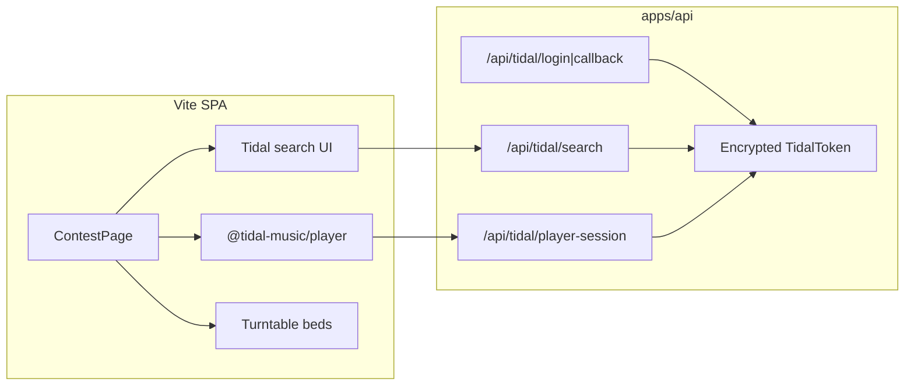

# Tidal integration plan (Blend Contest)

Goal for now: **search Tidal → load a track onto Deck 1 / Deck 2 → hear it while mixing.**  
Later: **admin-picked daily pair** as the contest round.

This plan ports the proven hybrid model from [Hercules](https://github.com/jantznick/hercules) (`docs/tidal-playback.md`) into this thinner contest app. Blend Contest already has leftover hooks for that model (`tidalTransport`, `muteBed1/2`, `.track-tidal-*` CSS) — we reuse them instead of inventing a second path.

---

## Constraints (non-negotiable)

| Constraint | Implication |
|------------|-------------|
| TIDAL audio is DRM-protected | Only `@tidal-music/player` may decode/play. **No** fetch-manifest → `decodeAudioData` → turntable. |
| Player SDK is effectively **one stream** | Two decks can each *own* a Tidal track id, but only **one** plays at a time. Switch listening with Deck 1 / Deck 2 play. |
| EQ / filter / XF on Tidal PCM | **Not available** today. Grading still works (it scores control motion), but the user hears the SDK `<audio>` output, not a mixable Web Audio graph. |
| Secrets / refresh tokens | Must live on a backend. SPA-only cannot safely hold `TIDAL_CLIENT_SECRET` or refresh tokens. |
| Full-length playback | Requires **user** Tidal OAuth (`playback` scope). Client-credentials alone = catalog + ~30s previews. |

**Honest UX for v1:** “Load Tidal onto a deck” means: that deck’s **label / BPM / transport** follow the Tidal track; PLAY/CUE drives the Player SDK; the practice bed for that deck is **muted** so you hear the song. Crossfader/EQ still move (and get graded) but do not reshape the Tidal stream.

---

## End state (two horizons)

### Horizon A — Free Play (this first ship)

```
User Connects Tidal → search → Load Deck 1 / Deck 2
  → Player SDK plays active deck
  → practice beds muted for loaded decks
  → Mix Ultra PLAY/CUE wired via existing tidalTransport
```

Local upload + synth beds stay as fallback when Tidal is disconnected.

### Horizon B — Daily contest (follow-up)

```
Site admin picks 2 Tidal track ids for “today”
  → ContestPage locks both decks to that pair
  → Users still Connect Tidal (needed to hear the tracks)
  → Start / End & grade unchanged
  → Optional: persist scores + round id
```

Admin selection is **catalog identity** (ids + metadata), not a shared stream URL. Each contestant still authenticates with their own Tidal account for playback.

---

## Architecture



**Port from Hercules (do not rewrite):**

| Piece | Source |
|-------|--------|
| OAuth + search + player-session | `apps/api/src/routes/tidal.ts`, `apps/api/src/lib/tidal.ts` |
| Player bootstrap | `src/tidal/playerSdk.ts` |
| Deck playback hook | `src/audio/useFreePlayTidalPlayback.ts` |
| Search → Deck 1/2 UI | `src/components/FreePlayTidalBrowser.tsx` (+ existing `contest.css` Tidal classes) |
| Env / redirect notes | Hercules `.env.example`, `docs/tidal-playback.md` |

**Slim vs Hercules:** skip full username/password/magic-link product for Horizon A if we can. Prefer a **session cookie that only exists to hold a linked TidalToken** (anonymous session → Connect Tidal → tokens keyed by session). Add real user accounts when contest scores / admin roles need them (Horizon B).

---

## Phase plan

### Phase 0 — Prerequisites (manual)

1. Create an app at [developer.tidal.com](https://developer.tidal.com/dashboard).
2. Enable scopes: `search.read` `playback` (add `playlists.read` / `collection.read` only if we want playlist/saved tabs later).
3. Register redirect URI exactly, e.g. local via Vite proxy:
   - `http://localhost:5173/api/tidal/callback`
4. Note `TIDAL_CLIENT_ID` / `TIDAL_CLIENT_SECRET` for `.env`.

### Phase 1 — Backend scaffold

Add `apps/api` (Express) + Postgres (Prisma) + `docker-compose`, mirrored from Hercules but trimmed:

- Session middleware (HttpOnly cookie)
- `GET /api/tidal/login` → PKCE authorize
- `GET /api/tidal/callback` → store encrypted tokens
- `GET /api/tidal/status` / `DELETE /api/tidal/disconnect`
- `GET /api/tidal/search?q=`
- `GET /api/tidal/tracks/:id`
- `GET /api/tidal/player-session` → `{ clientId, accessToken, expiresAt }` for the SDK
- Vite proxy `/api` → `:3001`
- `.env.example` with Tidal + session secrets

**Done when:** curl search works after a browser Connect Tidal round-trip; player-session returns a short-lived access token without exposing the refresh token to the SPA.

### Phase 2 — Frontend Free Play on contest decks

1. Add `@tidal-music/player` (+ thin API client with `credentials: 'include'`).
2. Port `src/tidal/playerSdk.ts` and `useFreePlayTidalPlayback`.
3. Replace / extend `TrackPickerBar` with a Tidal search panel (reuse CSS already in `contest.css`).
4. Wire `ContestPage`:
   - `muteBed1/2` when that deck has a Tidal ref
   - `tidalTransport` → Free Play play/stop/isPlaying
   - deck labels on `MixUltraDeck`
   - placeholder waveforms via existing `placeholderPeaks` when no local buffer
5. Keep catalog select + file upload as non-Tidal fallback.
6. Document hybrid behavior in README (link this plan).

**Done when:** Connect Tidal → search “Daft Punk” → Load Deck 1 → Arm → PLAY hears the track; Deck 2 can be loaded and switched; End & grade still runs on control logs.

### Phase 3 — Daily contest rounds (later)

1. App auth + **admin** role (or single admin bootstrap user).
2. `ContestRound` model: `date`, `tidalTrackIdA`, `tidalTrackIdB`, metadata snapshot, optional recipe.
3. Admin UI: search → set today’s pair → publish.
4. Contest mode: decks locked to published pair; search hidden (or reference-only).
5. Score persistence keyed by `(userId, roundId)`.

**Done when:** non-admin users open the site and only get today’s two songs; grading + leaderboard can attach to the round.

---

## What we deliberately do *not* do

- Unofficial stream proxies / manifest scraping
- Piping Tidal into `TurntableEngine` buffers
- Dual simultaneous Tidal streams (SDK limitation)
- Dropping local/synth beds until Player SDK exposes a mixable output
- Full Hercules curriculum / Neural Mix / playlist browser in Horizon A (search-only is enough)

---

## Suggested implementation order

```
Phase 0 (you)     Register Tidal app + secrets
Phase 1           API + OAuth + search + player-session
Phase 2           Port Free Play UI/playback into ContestPage
Phase 3           Admin daily pair + lock decks
```

Phases 1–2 are the “get going” slice. Phase 3 is the contest product shape you described.

---

## Open decisions (resolve before / during Phase 1)

1. **Auth thickness:** anonymous session + Connect Tidal only (faster), or port Hercules user accounts now because scores need identity soon?
2. **Playlist / My Collection tabs:** include in Phase 2 or search-only?
3. **Hosting:** same Railway-style split as Hercules (API + static SPA), or one host with API under `/api`?
4. **When Tidal is disconnected:** keep today’s upload/synth picker visible (recommended) or hard-gate the page?

Recommendation defaults: **(1) anonymous session for Horizon A**, **(2) search-only**, **(3) match Hercules deploy once it exists**, **(4) keep fallback picker**.
